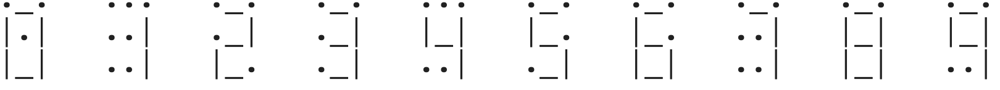
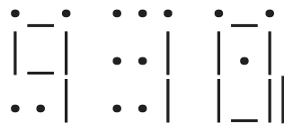

Your task is to create an LCD string representation of an
integer value using a 3x3 grid of space, underscore, and
pipe characters for each digit. Each digit is shown below
(using a dot instead of a space)

Example: 910

